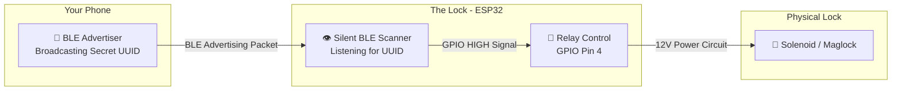
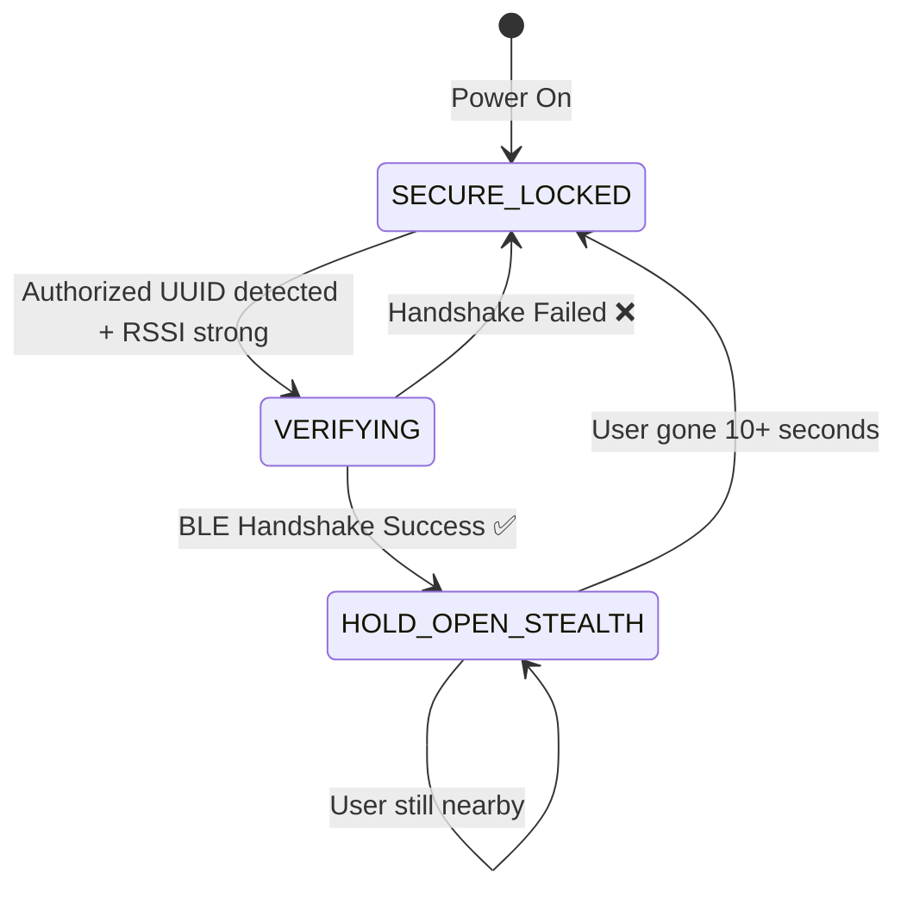
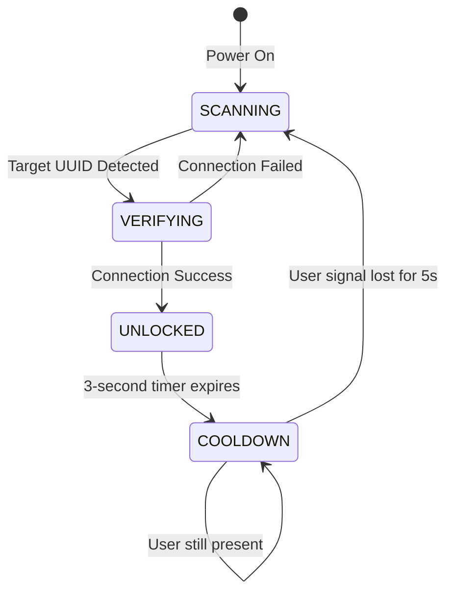
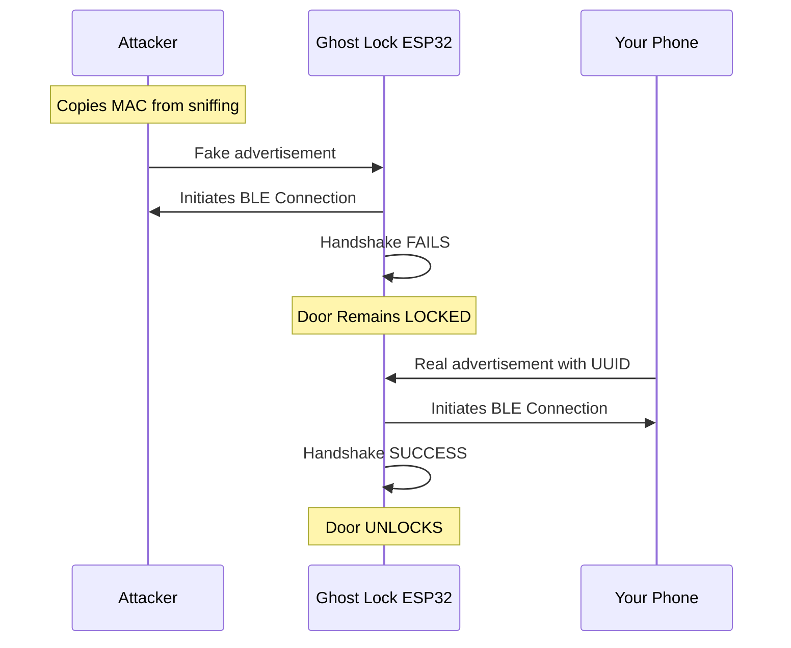

# Ghost Lock — Final Project Draft

> **A Stealth BLE Proximity Lock System Using ESP32**
> Authors: Devansh Khosla 

---

## 1. Abstract

Ghost Lock is an invisible Bluetooth Low Energy (BLE) proximity lock that uses a smartphone as a silent digital key. Unlike commercial smart locks that advertise their presence, Ghost Lock operates as a **passive BLE observer** — completely invisible to Bluetooth scanners. The system authenticates users through a **128-bit Service UUID** combined with a **BLE connection handshake** to prevent spoofing. When a verified phone approaches, the lock opens silently; when the user leaves, it auto-locks. The project was developed across three phases: Python simulation on macOS, Wokwi virtual simulation, and physical ESP32 hardware deployment.

---

## 2. Problem Statement

Traditional smart locks suffer from three fundamental weaknesses:

| Weakness | Description |
|----------|-------------|
| **Visibility** | They advertise themselves via BLE/WiFi, inviting attack |
| **MAC Spoofing** | Older systems trust MAC addresses, which are trivially clonable |
| **User Friction** | Require apps, buttons, or PINs to operate |

**Ghost Lock solves all three**: it never advertises (invisible), verifies identity via cryptographic handshake (anti-spoof), and requires zero user interaction (hands-free).

---

## 3. System Architecture

### 3.1 High-Level Overview



### 3.2 The "Sentinel" Security Model

The lock **never trusts the advertisement alone**. It performs a full BLE connection handshake:

1. **Scan** — Listen silently for a specific 128-bit Service UUID
2. **RSSI Check** — Is the signal stronger than −75 dBm? (Is the user close enough?)
3. **Connect** — Attempt a full BLE connection to the broadcasting device
4. **Verify** — If the handshake completes, the device is genuine
5. **Execute** — Unlock the door (GPIO HIGH → Relay → Lock)
6. **Stealth** — Immediately disconnect to reset security state

### 3.3 Why UUID Instead of MAC Address?

Modern smartphones use **MAC Address Randomization** — they change their Bluetooth MAC every few hours for privacy. A MAC-based system would stop working overnight. Instead, we use a **128-bit Service UUID** configured via the nRF Connect app, which remains constant regardless of MAC rotation.

---

## 4. State Machine — Core Logic

### 4.1 Hold-Open Mode (Final Version — `ESP32.ino`)



**State Descriptions:**

| State | Door | ESP32 Activity |
|-------|------|---------------|
| `SECURE_LOCKED` | 🔒 Locked | Scanning for authorized UUIDs |
| `VERIFYING` | 🔒 Locked | Connecting to verify identity |
| `HOLD_OPEN_STEALTH` | 🔓 Unlocked | Monitoring presence, disconnected (stealth) |

### 4.2 Pulse Mode (Alternative — `NewApproach.ino`)



---

## 5. Security Analysis

### 5.1 Attack Vector Matrix

| Attack Type | How It Works | Ghost Lock Defense | Protected? |
|-------------|-------------|-------------------|------------|
| **MAC Spoofing** | Clone phone's MAC | Handshake verification | ✅ YES |
| **Replay Attack** | Record and replay packets | Connection-based auth | ✅ YES |
| **BT Scanning** | Scan for nearby devices | ESP32 never advertises | ✅ YES |
| **UUID Brute Force** | Guess the 128-bit UUID | 2^128 combinations | ✅ YES |
| **Physical Tampering** | Access ESP32 wiring | Secure enclosure needed | ⚠️ Partial |
| **Signal Jamming** | Block all BLE signals | No defense | ❌ NO |
| **Phone Theft** | Steal the user's phone | Same as physical keys | ❌ NO |

### 5.2 Anti-Spoofing Sequence



### 5.3 Five Defense Layers

1. **Invisibility**: ESP32 operates as BLE Central (observer only)
2. **UUID Filtering**: Only responds to authorized 128-bit identifiers
3. **RSSI Threshold**: Must be within physical proximity (−75 dBm ≈ 3–5m)
4. **Connection Handshake**: Verifies cryptographic BLE identity
5. **Auto-Lock Timeout**: Locks automatically when presence is lost

---

## 6. Project File Inventory

### 6.1 Complete File Map

```
Ghost-Lock/
├── 🔧 FINAL Hardware Firmware
│   ├── ESP32.ino              # ★ FINAL: Hold-Open + Multi-User
│   ├── GhostLock_LED.ino      # ★ FINAL + Built-in LED testing
│   └── LogicSimulation.ino    # Serial-based logic tester
│
├── 📜 Legacy Firmware (Reference Only)
│   ├── NewApproach.ino        # v2: Pulse Mode (3s unlock)
│   ├── NewApproch2.0.ino      # v3: Hold-Open (single UUID)
│   └── StealthLock.ino        # v1: MAC-based (DEPRECATED)
│
├── 🖥️ macOS Simulation Scripts
│   ├── simulation.py          # v1: Basic RSSI observer
│   ├── simulation_new.py      # v2: Pulse mode with cooldown
│   ├── simulation_newapproach2.py # v3: Hold-Open simulation
│   ├── scanner.py             # BT device discovery tool
│   └── main.py                # Auto-lock daemon
│
├── 🌐 Wokwi Virtual Simulation
│   ├── wokwi_simulation/sketch.ino
│   ├── wokwi_simulation/diagram.json
│   └── wokwi_simulation/libraries.txt
│
└── 📖 Documentation
    ├── FINAL_DRAFT.md         # ★ THIS FILE
    ├── README.md              # Full project README
    ├── PROJECT_ARCHITECTURE.md
    ├── FIRMWARE_COMPARISON.md
    ├── SECURITY_FAQ.md
    ├── NEW_APPROACH_GUIDE.md
    ├── MOBILE_TEST_GUIDE.md
    └── Project_Docs/
```

### 6.2 Key Files Explained

| File | Version | Purpose |
|------|---------|---------|
| **`ESP32.ino`** | ★ FINAL | Production firmware: Hold-Open, Multi-User, NimBLE v2.x |
| **`GhostLock_LED.ino`** | ★ FINAL | Same + built-in LED for testing without relay |
| **`LogicSimulation.ino`** | Testing | Type `near`/`far`/`spoof` to test logic via Serial |
| `StealthLock.ino` | DEPRECATED | MAC-based, vulnerable to spoofing |
| `NewApproach.ino` | Legacy v2 | Pulse mode, single UUID, old API |
| `NewApproch2.0.ino` | Legacy v3 | Hold-Open, single UUID, old API |

---

## 7. Evolution Timeline

| Version | File | Auth Method | Mode | Users | BLE API |
|---------|------|-------------|------|-------|---------|
| v1 | `StealthLock.ino` | MAC Address | Presence | 1+ | ESP-BLE |
| v2 | `NewApproach.ino` | UUID + Handshake | Pulse (3s) | 1 | NimBLE 1.x |
| v3 | `NewApproch2.0.ino` | UUID + Handshake | Hold-Open | 1 | NimBLE 1.x |
| **★ FINAL** | **`ESP32.ino`** | **UUID + Handshake** | **Hold-Open** | **Multi** | **NimBLE 2.x** |

---

## 8. Hardware Design

### 8.1 Bill of Materials

| Component | Qty | Purpose | Cost |
|-----------|-----|---------|------|
| ESP32-WROOM-32 Dev Board | 1 | BLE scanner + controller | $5–8 |
| 5V Relay Module | 1 | Switches lock power | $2–3 |
| 12V Solenoid Lock | 1 | Physical door lock | $10–15 |
| 12V Power Supply (2A) | 1 | Powers the lock | $5–8 |
| Jumper Wires (F-F) | 5 | Connections | $1–2 |


### 8.2 Wiring Diagram

```
┌─────────────────────────────────────────────────┐
│              ESP32 Development Board            │
│                                                 │
│   3.3V ──────────────────────────────────┐      │
│   GND  ────────────────────────────┐     │      │
│   GPIO 4 ─────────────────┐        │     │      │
└───────────────────────────│────────│─────│──────┘
                            │        │     │
                         ┌──▼────────▼─────▼─────┐
                         │   5V Relay Module     │
                         │  [IN] [GND] [VCC]     │
                         │  [COM] [NO]  [NC]     │
                         └───│─────│─────────────┘
                             │     │
                      ┌──────▼─────▼──────┐
                      │  12V Solenoid Lock │
                      └────────────────────┘
                             ▲
                      ┌──────┴──────┐
                      │  12V 2A PSU │
                      └─────────────┘
```

### 8.3 Pin Mapping

| ESP32 Pin | Connects To | Wire |
|-----------|-------------|------|
| GPIO 4 | Relay IN | Green |
| 3.3V | Relay VCC | Red |
| GND | Relay GND | Black |
| GPIO 2 | Built-in LED (optional) | On-board |

---

## 9. Phone Setup (Digital Key)

### 9.1 nRF Connect for Mobile

**Download:** [Android](https://play.google.com/store/apps/details?id=no.nordicsemi.android.mcp) | [iOS](https://apps.apple.com/us/app/nrf-connect-for-mobile/id1054362403)

### 9.2 Steps

1. Open app → **ADVERTISER** tab
2. Tap **+** → Name it "Ghost Key"
3. **Add Record** → **Service UUID**
4. Enter: `12345678-1234-1234-1234-1234567890ab`
5. Set to **Connectable**
6. Toggle **ON**

### 9.3 Multi-User Setup

Each person uses a unique UUID in the firmware:

```cpp
std::vector<NimBLEUUID> authorizedUUIDs = {
    NimBLEUUID("12345678-1234-1234-1234-1234567890ab"), // You
    NimBLEUUID("aaaaaaaa-bbbb-cccc-dddd-eeeeeeeeeeee"), // Friend 1
};
```

**Revoke access**: Delete their UUID line → re-upload firmware.

---

## 10. Development Roadmap

| Phase | Status | Description |
|-------|--------|-------------|
| 1. Python Simulation | ✅ Done | Validated all logic flows on macOS |
| 2. Wokwi Simulation | ✅ Done | Tested in browser-based ESP32 simulator |
| 3. Code Finalization | ✅ Done | NimBLE v2.x API, multi-user UUIDs |
| 4. Phone Config | ✅ Done | nRF Connect advertiser configured |
| 5. ESP32 Hardware Test | 🔄 Next | Flash firmware → Read serial logs → Tune RSSI |
| 6. Relay + Lock | ⬜ Pending | Wire relay module, connect lock |
| 7. Deployment | ⬜ Pending | Mount, permanent power, field testing |

### Arduino IDE Setup (Phase 5)

1. Install [Arduino IDE](https://www.arduino.cc/en/software)
2. Settings → Additional Board URLs → `https://espressif.github.io/arduino-esp32/package_esp32_index.json`
3. Board Manager → search `esp32` → Install
4. Library Manager → search `NimBLE-Arduino` → Install
5. Select Board: `ESP32 Dev Module` → Upload

---

## 11. Firmware Comparison

| Feature | Pulse Mode | Hold-Open Mode |
|---------|-----------|---------------|
| **Unlock Duration** | Fixed 3 seconds | While user is nearby |
| **Relock Trigger** | Timer | Signal loss (10s) |
| **Best For** | Front doors | Offices, bedrooms |
| **Power Usage** | Low | Higher |
| **Lock Type** | Solenoid / Strike | Maglock / Deadbolt |

---

## 12. RSSI Calibration Guide

| RSSI Value | Distance | Use Case |
|------------|----------|----------|
| −40 dBm | ~0.5m | High security |
| −60 dBm | ~1–2m | Close proximity |
| **−75 dBm** | **~3–5m** | **Default** |
| −85 dBm | ~5–8m | Large rooms |
| −95 dBm | ~10m+ | Through walls |

---

## 13. Expected Serial Monitor Logs

**Normal Unlock:**
```
=== Ghost Lock v3: Hold-Open Mode ===
 [DOOR LOCKED]
Target in Range. Initiating Security Handshake...
Identity Verified. Unlocking...
```

**Auto-Lock (user left):**
```
User Left Range. Auto-Locking.
 [DOOR LOCKED]
```

**Spoof Blocked:**
```
Target in Range. Initiating Security Handshake...
Verification Failed (Spoof attempt?). Remaining Locked.
```

---

## 14. FAQ

**Q: Will the ESP32 show up on other people's Bluetooth?**
A: **No.** It acts as a passive listener. Completely invisible.

**Q: What if my phone dies?**
A: Always have a mechanical key backup. Ghost Lock is a convenience layer.

**Q: Can someone replay my signal?**
A: **No.** The lock requires a live BLE handshake, not just a broadcast.

**Q: What if someone discovers my UUID?**
A: Generate a new one at [uuidgenerator.net](https://www.uuidgenerator.net/) and re-upload firmware.

**Q: Does this work through walls?**
A: Yes, but with reduced range. Adjust RSSI threshold accordingly.

**Q: Does the phone app need to stay open?**
A: Android: can minimize. iOS: must stay in foreground (use Guided Access).


**Q: What happens during a power outage?**
A: Depends on lock type. Solenoid (fail-secure) stays locked. Maglock (fail-safe) unlocks.

---

## 15. Known Limitations & Future Work

**Current Limitations:**
- Requires nRF Connect app on phone
- UUID changes require firmware re-upload
- Vulnerable to RF jamming
- Single relay output (one lock per ESP32)

**Future Enhancements:**
- OTA firmware updates (WiFi-based UUID management)
- BLE Bonding for encrypted pairing
- Web dashboard for user management
- Deep sleep mode for battery power
- Event logging to ESP32 flash storage

---

## 16. Safety Disclaimer

> ⚠️ This project involves 12V power circuits and physical security. Always install a mechanical backup key. Not suitable for commercial use without certifications. Check local building codes. **Use at your own risk.**

---

## 17. References

| Resource | Link |
|----------|------|
| ESP32 Arduino Core | [docs.espressif.com](https://docs.espressif.com/projects/arduino-esp32/en/latest/) |
| NimBLE-Arduino | [github.com/h2zero](https://github.com/h2zero/NimBLE-Arduino) |
| nRF Connect | [nordicsemi.com](https://www.nordicsemi.com/Products/Development-tools/nrf-connect-for-mobile) |
| UUID Generator | [uuidgenerator.net](https://www.uuidgenerator.net/) |
| BLE Fundamentals | [learn.adafruit.com](https://learn.adafruit.com/introduction-to-bluetooth-low-energy) |

---

*Ghost Lock Project — Final Draft — April 2026*
