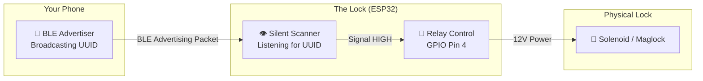
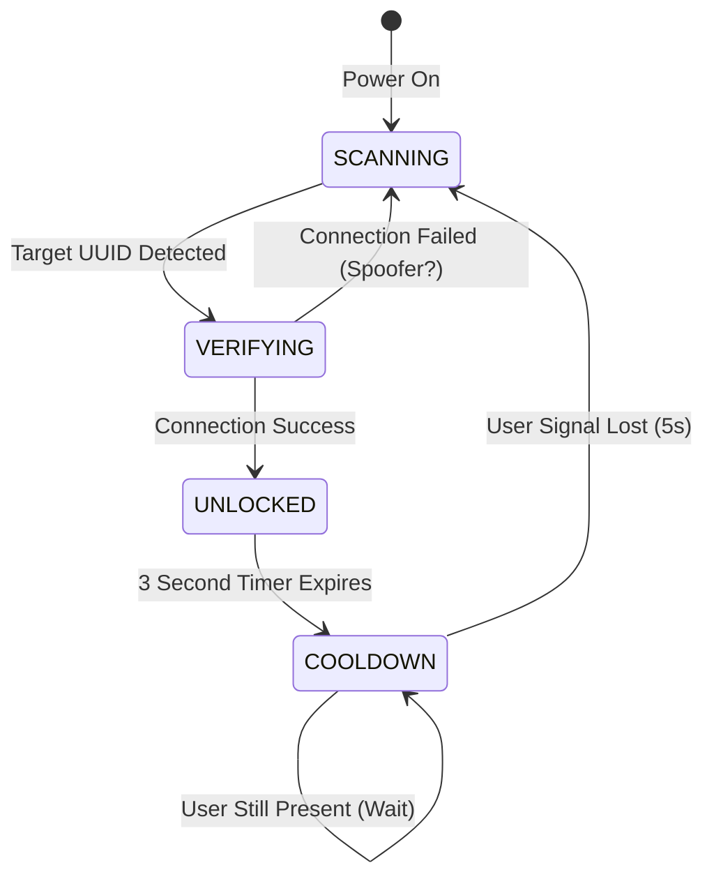
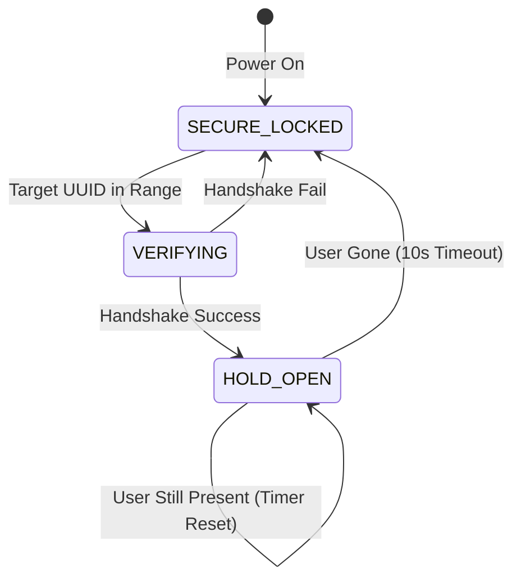
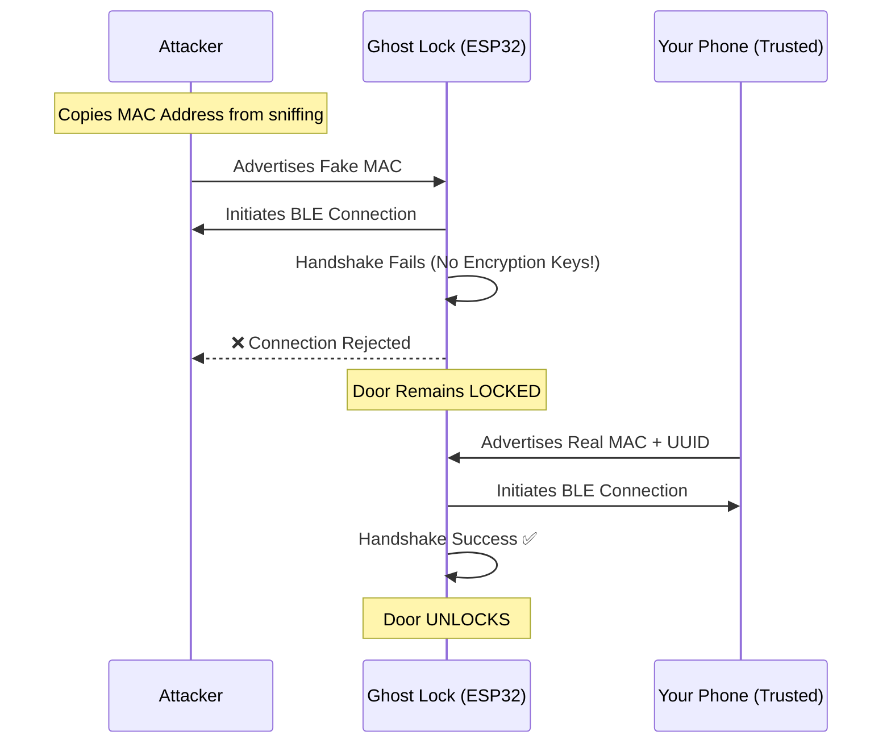

# Ghost Lock - Project Architecture

> A Stealth Digital Lock System using ESP32 and BLE

---

## 1. System Overview



---

## 2. Core Principle: "Security Through Invisibility"

| Traditional Lock | Ghost Lock |
| :--- | :--- |
| Advertises "I am a SmartLock!" | **Never advertises anything.** |
| Visible to Bluetooth scanners | **Invisible.** Acts as a silent listener. |
| Hackable via replay attacks | **Requires BLE Handshake** (Anti-Spoof). |

---

## 3. State Machine Diagram

### Version 1: Pulse Mode (`NewApproach.ino`)



### Version 2: Hold-Open Mode (`NewApproch2.0.ino`)



---

## 4. Firmware Comparison

| Feature | `NewApproach.ino` | `NewApproch2.0.ino` |
| :--- | :---: | :---: |
| **Logic Type** | Pulse (Momentary) | Hold-Open (Presence) |
| **Unlock Duration** | Fixed 3 Seconds | While User is Near |
| **Relock Trigger** | Timer | Signal Loss (10s) |
| **Stealth Level** | ⭐⭐⭐⭐⭐ | ⭐⭐⭐⭐⭐ |
| **Hardware Compatibility** | Solenoid, Strike | Maglock, Deadbolt |
| **Power Consumption** | Low | Higher (Relay always on) |
| **User Experience** | "Click" unlock | "Seamless" open office |

---

## 5. Security Analysis

### Attack Vector: MAC Address Spoofing



> [!IMPORTANT]
> The attacker cannot complete the **BLE Handshake** without your phone's encryption keys. This is the "Sentinel" security layer.

---

## 6. Hardware Wiring Diagram

```
┌─────────────────────────────────────────────────┐
│                   ESP32 Dev Board               │
│                                                 │
│   3.3V ──────────────────────────────────┐      │
│   GND  ────────────────────────────┐     │      │
│   GPIO 4 ─────────────────┐        │     │      │
│                           │        │     │      │
└───────────────────────────│────────│─────│──────┘
                            │        │     │
                            ▼        ▼     ▼
                     ┌──────────────────────────┐
                     │      5V Relay Module     │
                     │   [IN] [GND] [VCC]       │
                     │                          │
                     │   [COM] [NO] [NC]        │
                     └────│─────│───────────────┘
                          │     │
                          ▼     ▼
                 ┌────────────────────────┐
                 │   12V Solenoid Lock    │
                 │   (+)            (-)   │
                 └────────────────────────┘
                          │
                          ▼
                     12V Power Supply
```

---

## 7. Phone Setup (Advertising UUID)

1.  **Download**: nRF Connect for Mobile (Android/iOS).
2.  **Generate UUID**: [uuidgenerator.net](https://www.uuidgenerator.net/)
3.  **Configure Advertiser**:
    *   Go to **Advertiser** tab.
    *   Add a **Service UUID** record.
    *   Paste your unique UUID.
    *   Toggle **ON**.
4.  **Update Firmware**: Paste the same UUID into `NewApproach.ino` line 20.

---

## 8. File Structure

```
Digital-Presence? lock mechanism idk/
├── StealthLock.ino           # Original Passive Observer (MAC-based)
├── NewApproach.ino           # Secure Pulse Mode (NimBLE)
├── NewApproch2.0.ino         # Secure Hold-Open Mode (NimBLE)
├── simulation.py             # Mac Simulation for StealthLock
├── simulation_new.py         # Mac Simulation for NewApproach
├── scanner.py                # Bluetooth Device Scanner
├── main.py                   # Mac Auto-Lock Daemon
├── INSTRUCTIONS.md           # Wiring & Setup Guide
├── SECURITY_FAQ.md           # Security Q&A
├── FIRMWARE_COMPARISON.md    # Pulse vs Hold-Open
├── NEW_APPROACH_GUIDE.md     # Phone Advertiser Setup
├── MOBILE_TEST_GUIDE.md      # Testing with Old Phone
└── PROJECT_ARCHITECTURE.md   # This Document
```

---

## 9. Decision Matrix: Which Firmware?

| Scenario | Recommended Firmware |
| :--- | :--- |
| Front door of house | `NewApproach.ino` (Pulse) |
| Office door (stay open while working) | `NewApproch2.0.ino` (Hold-Open) |
| Server room (maximum security) | `NewApproach.ino` + Bonding |
| Garage door (motor already handles lock) | Either |
