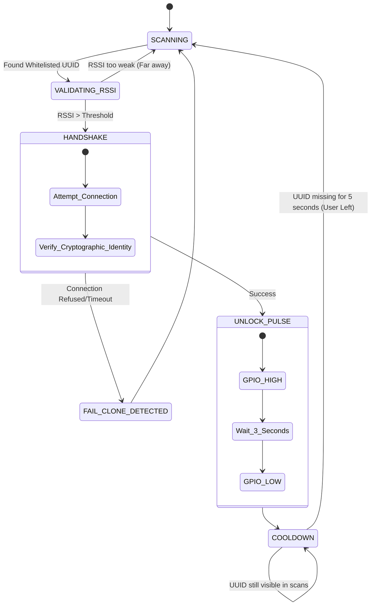

# Explanation: `NewApproach.ino`

## Purpose
`NewApproach.ino` represents the primary **Pulse Mode** firmware for the ESP32 microcontroller in the Ghost Lock system. It's meant for situations where a brief, timed unlock is desired (e.g., a standard front door strike).

## Firmware Logic Flow

## Detailed Analysis
- **BLE Server & Scanning**: Uses the custom `NimBLE` library, which is a lightweight alternative to the standard Arduino BLE library, to minimize memory usage, prevent brownouts from the ESP32 radio, and maximize connection reliability.
- **Whitelist Initialization**: Advertises the expected service UUID (the user's phone). It strictly filters out all other Bluetooth traffic.
- **Triggering Relay**: If authenticated and within the proper RSSI range, it sets `GPIO 4` `HIGH` for exactly 3 seconds to pulse a mechanical strike, then instantly goes `LOW` to lock it back.
- **Cooldown**: Prevents retriggering indefinitely by requiring the phone UUID to disappear from the scan results for a set time limit before resetting to idle. This solves the "Ghost Looping" where leaning near the door triggers it 100 times.
