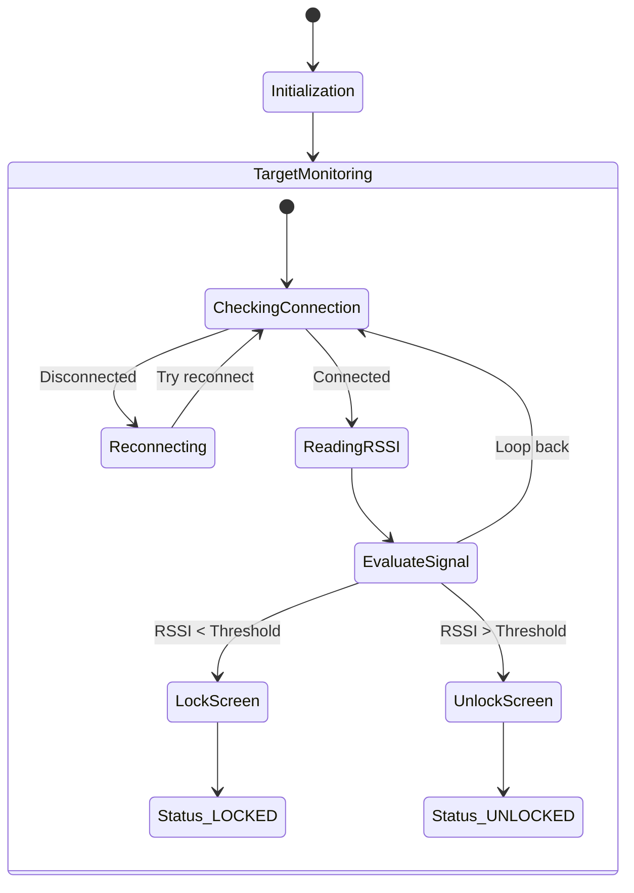

# Explanation: `main.py`

## Purpose
`main.py` serves as the primary orchestration daemon for the Python-based lock system or simulation. It integrates the core auto-locking logic and manages the broader application context, like locking the OS level screen based on presence.

## Logic Flow Visualization



## Process Flow
- **Daemon Initialization**: Sets up logging and establishes the loop.
- **Link Maintenance**: It forces "Sniff Mode" updates on macOS by requesting `remoteNameRequest_action_` so that the RSSI actually updates. **This is a crucial hack** for real-time tracking on Mac.
- **OS Actions**: Uses Quartz and Obj-C bridges to physically sleep/lock the mac or type the password.

## Source Code

```python
import argparse
import time
import subprocess
import sys
import IOBluetooth
import Quartz

def lock_screen():
    print("Locked due to low signal or disconnection.")
    try:
        import objc
        bundle = objc.loadBundle('Login', globals(), bundle_path='/System/Library/PrivateFrameworks/Login.framework')
        functions = [('SACLockScreenImmediate', b'v')]
        objc.loadBundleFunctions(bundle, globals(), functions)
        SACLockScreenImmediate()
    except Exception as e:
        print(f"Visual lock failed ({e}). Fallback to display sleep.")
        subprocess.run(['pmset', 'displaysleepnow'])

def wake_screen():
    print("Waking screen...")
    subprocess.run(['caffeinate', '-u', '-t', '1'])

def type_string(string):
    """
    Simulates typing a string using Quartz events. 
    """
    for char in string:
        event_down = Quartz.CGEventCreateKeyboardEvent(None, 0, True)
        Quartz.CGEventKeyboardSetUnicodeString(event_down, 1, char)
        Quartz.CGEventPost(Quartz.kCGHIDEventTap, event_down)
        
        event_up = Quartz.CGEventCreateKeyboardEvent(None, 0, False)
        Quartz.CGEventKeyboardSetUnicodeString(event_up, 1, char)
        Quartz.CGEventPost(Quartz.kCGHIDEventTap, event_up)
        
        time.sleep(0.01)

    event_enter_down = Quartz.CGEventCreateKeyboardEvent(None, 36, True)
    Quartz.CGEventPost(Quartz.kCGHIDEventTap, event_enter_down)
    event_enter_up = Quartz.CGEventCreateKeyboardEvent(None, 36, False)
    Quartz.CGEventPost(Quartz.kCGHIDEventTap, event_enter_up)

def unlock_screen(password=None):
    if not password:
        print("No password provided. Waking screen only.")
        wake_screen()
        return

    print("Waking and unlocking...")
    wake_screen()
    time.sleep(1.5) 
    
    print("Typing password...")
    type_string(password)

def get_device_by_address(address):
    devices = IOBluetooth.IOBluetoothDevice.pairedDevices()
    if not devices:
        return None
    for device in devices:
        if device.addressString().replace("-", ":").upper() == address.replace("-", ":").upper():
            return device
    return None

def main():
    parser = argparse.ArgumentParser(description="Bluetooth Auto-Lock Daemon")
    parser.add_argument("--device", required=True, help="MAC Address of the Bluetooth device")
    parser.add_argument("--lock-rssi", type=int, default=-75, help="RSSI threshold to LOCK")
    parser.add_argument("--unlock-rssi", type=int, default=-65, help="RSSI threshold to UNLOCK")
    parser.add_argument("--interval", type=float, default=1.0, help="Check interval in seconds")
    parser.add_argument("--password", help="System password to auto-type")
    
    args = parser.parse_args()
    
    target_device = get_device_by_address(args.device)
    if not target_device:
        print(f"Error: Device {args.device} not found in paired devices.")
        sys.exit(1)

    print(f"Monitoring {target_device.name()} ({args.device})...")
    is_locked = False
    
    try:
        while True:
            connected = target_device.isConnected()

            if not connected:
                if not is_locked:
                    lock_screen()
                    is_locked = True
                target_device.openConnection()
            
            if target_device.isConnected():
                # Force link activity to update RSSI (Bluetooth "Sniff Mode" fix)
                try:
                    target_device.remoteNameRequest_action_(None, None)
                except Exception:
                    pass 

                raw_rssi = target_device.rawRSSI()
                if raw_rssi == 127: 
                    time.sleep(args.interval)
                    continue
                    
                print(f"Current RSSI: {raw_rssi} dBm")
                
                if raw_rssi < args.lock_rssi and not is_locked:
                    lock_screen()
                    is_locked = True
                elif raw_rssi > args.unlock_rssi and is_locked:
                    unlock_screen(args.password)
                    is_locked = False
            
            time.sleep(args.interval)
            
    except KeyboardInterrupt:
        print("\nStopping monitor...")
        sys.exit(0)

if __name__ == "__main__":
    main()
```
