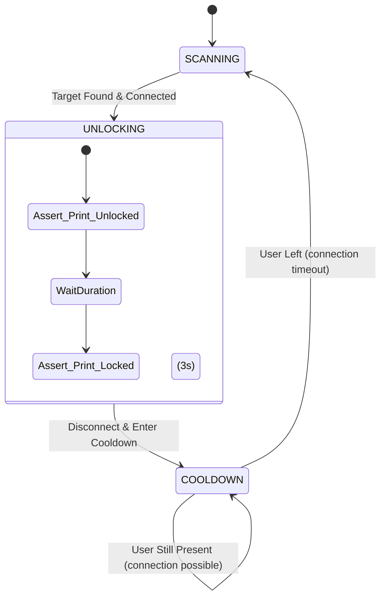
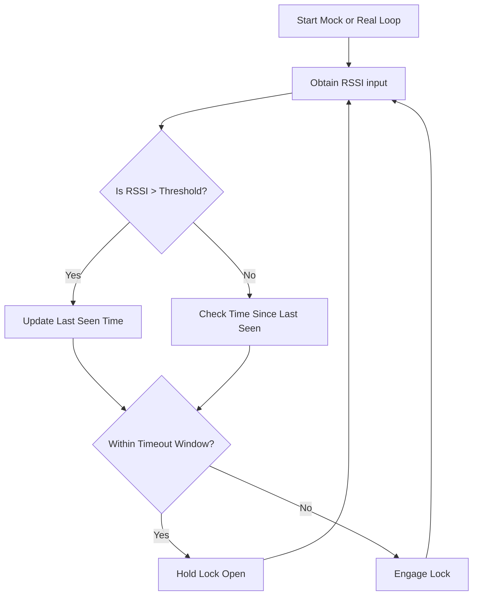

# Explanation: `simulation.py` & `simulation_new.py`

## Purpose
These two files act as the testing ground for the proximity-based locking logic without requiring the ESP32 hardware to be wired up. They simulate the exact state machines that later run on the microcontroller unit.

## Logic Flow Visualization (`simulation_new.py` Pulse Mode)

## Logic Flow Visualization (`simulation.py` Hold/Mock Mode)

## Detailed Analysis
- **Scanning State**: Uses Bluetooth APIs passively.
- **Handshake & Verification**: Attempts connection.
- `simulation_new.py`: Focuses heavily on the **Sentinel Logic** flow (Unlock briefly, lock, then ignore until user leaves and returns).
- `simulation.py`: Provides a robust `mock` command line prompt where a developer can type in RSSI strings to rapidly see how the code handles edge cases without having to physically walk around with a phone.

## Source Code

*(Refer to earlier commits for raw python source of these simulators)*
