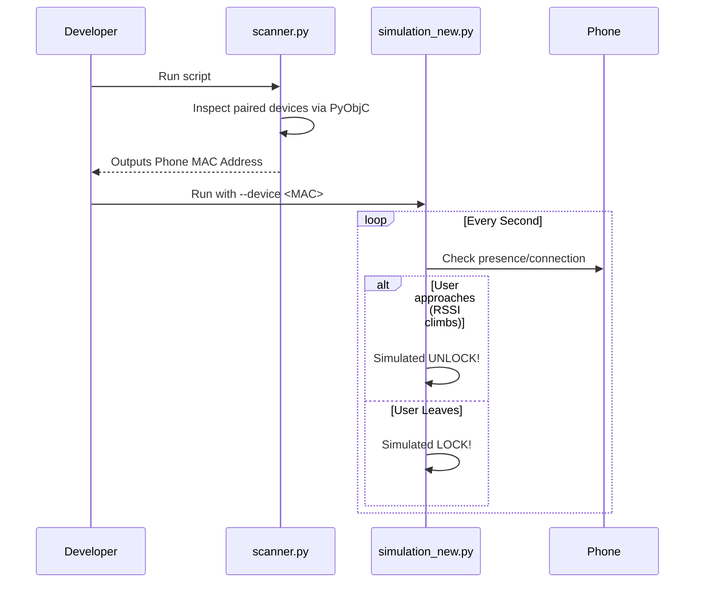
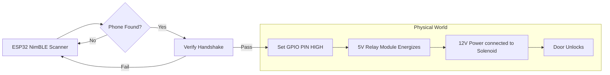

# Project Phases

The **Ghost Lock** project is divided into two primary phases: Simulation and Hardware Deployment. This approach ensures all logic and anti-spoofing techniques are verified before involving physical electronics.

## Phase 1: Software Simulation (macOS)
Before committing to hardware components, the project focuses on software simulation on macOS using the built-in Bluetooth hardware.

### Objective Flow

### Key Milestones
- **Device Discovery**: Discover and identify the MAC.
- **Connection Logic Simulation**: Simulate locking and unlocking mechanisms checking for presence.
- **Cooldown Logic validation**: Observe edge cases in software before real hardware test.

---

## Phase 2: Hardware Implementation (ESP32)
The validated logic is ported to C++ to run on a cheap, power-efficient ESP32 microcontroller mapping software states to GPIO pins.

### Hardware Control Flow

### Key Milestones
- **Firmware Flashing**: Upload optimized C++ code (`NewApproach.ino`, `NewApproch2.0.ino`).
- **Hardware Integration**: Wire ESP32 to Relay and Relay to Solenoid Lock.
- **Deployment**: Final field tests.
