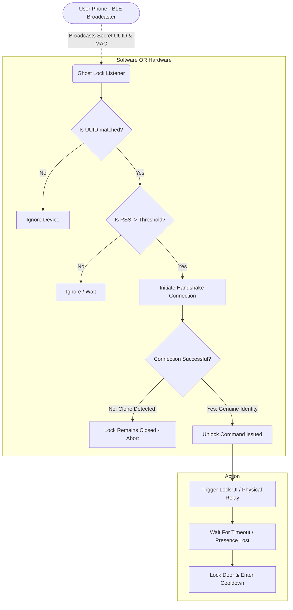
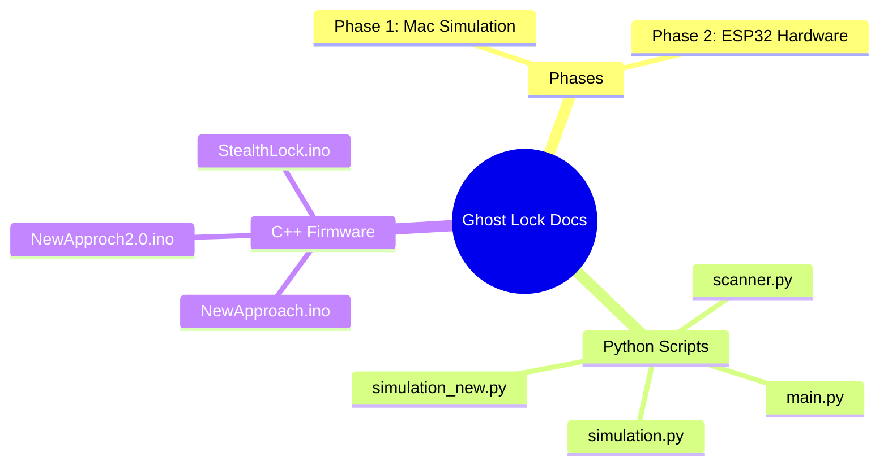

# Comprehensive Project Documentation Bundle & Architectural Overview

Welcome to the **Ghost Lock - Stealth BLE Proximity Lock System**.

This `README.md` serves as the central hub for the project code analysis, architectural ideas, security logic flows, and overall documentation. The goal of this project is to build an invisible Bluetooth proximity lock that unlocks automatically when an authorized user's phone approaches and locks upon departure.

## The Idea & Core Analysis

### Why "Ghost Lock"?
Traditional smart locks are inherently visible; they advertise their BLE or WiFi networks, inviting scanners and potential attacks ("Here I am, try to pick my digital lock!"). 
**Ghost Lock flips this dynamic.** 
The lock itself acts as a **passive listener** (BLE Central Client), waiting in stealth mode for your smartphone to broadcast a specific, secret UUID. Because the lock doesn't advertise, it's virtually invisible to wardriving scanners. 

### Security & Anti-Spoofing
A classic vulnerability in proximity systems is "MAC Spoofing" – an attacker intercepts your phone's MAC address and clones it. We solve this through the **Sentinel Verification Handshake**:
1. The lock sees the MAC that claims to have the secret UUID.
2. The lock *challenges* the beacon by attempting to establish a full BLE connection.
3. If the connection drops or fails instantly (because a spoofer only copied the broadcast, not the actual cryptographic stack), the lock refuses to open.

## Overarching Project Logic Flow

Below is the abstract visual representation of the Ghost Lock architecture, connecting the physical layer, the firmware/software layer, and the access flow.

## How to use this folder

- **`Project_Phases.md`**: Outlines the simulation and hardware phases of the Ghost Lock project, heavily annotated with state machine diagrams.
- **`Code_Explanations/`**: Contains deeply analyzed markdown files for every important source file, complete with Logic Flow diagrams and the raw inline source code. 

## Folder Structure Summary

Dive into the other files in this directory to see exact execution flows for every file!
