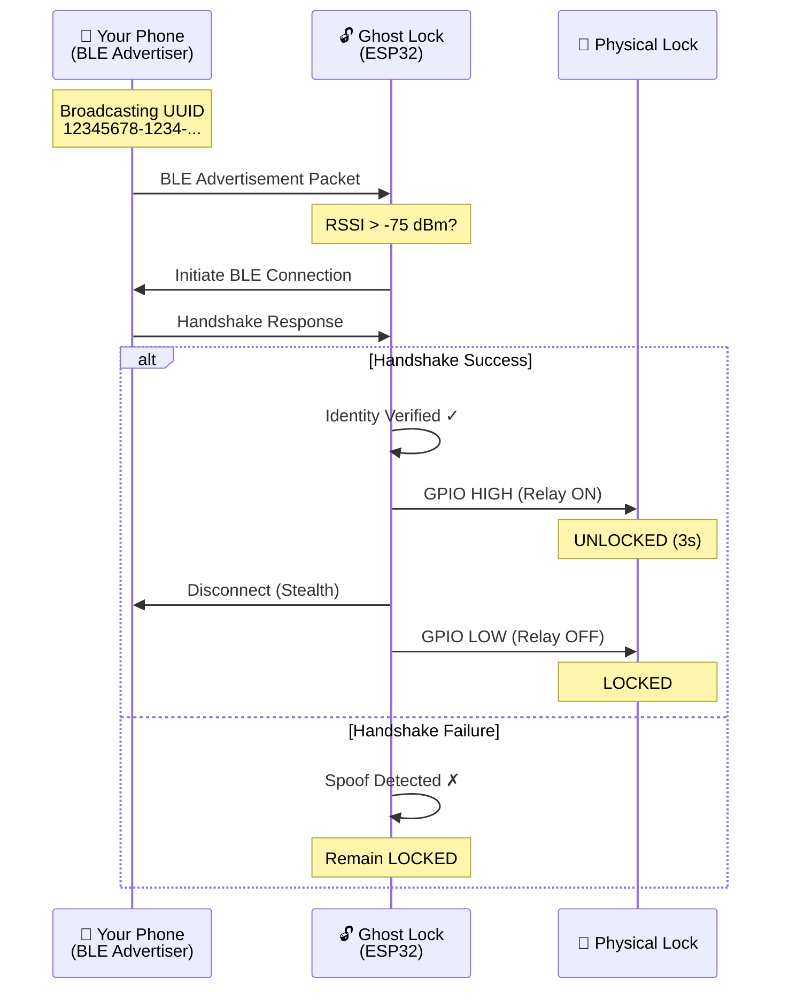
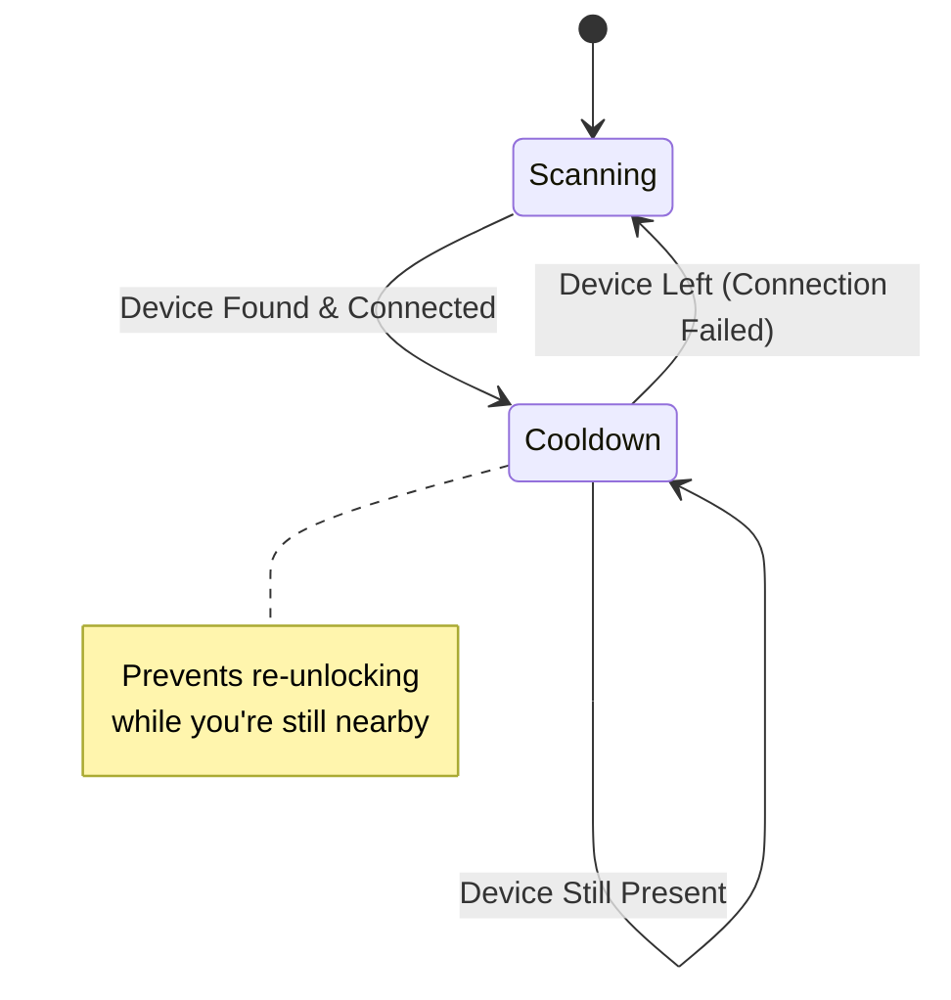

# Bluetooth_Sentenial
# Ghost Lock - Stealth BLE Proximity Lock System

> A security-first, invisible Bluetooth Low Energy proximity lock that uses your phone as a silent key. No apps, no buttons, no visibility—just walk up and enter.

[](LICENSE)
[](https://www.espressif.com/en/products/socs/esp32)
[](https://www.bluetooth.com/)

---

## 📋 Table of Contents

- [Overview](#overview)
- [How It Works](#how-it-works)
- [Security Architecture](#security-architecture)
- [Project Structure](#project-structure)
- [Phase 1: Software Simulation (macOS)](#phase-1-software-simulation-macos)
- [Phase 2: Hardware Implementation (ESP32)](#phase-2-hardware-implementation-esp32)
- [Phone Configuration](#phone-configuration)
- [Installation & Setup](#installation--setup)
- [Choosing Your Firmware](#choosing-your-firmware)
- [Testing & Validation](#testing--validation)
- [Security Considerations](#security-considerations)
- [Troubleshooting](#troubleshooting)
- [FAQ](#faq)

---

## 🎯 Overview

**Ghost Lock** is an invisible Bluetooth proximity lock system that unlocks automatically when you approach and locks when you leave. Unlike traditional smart locks:

- **Completely Invisible**: The lock never advertises its presence—it only listens
- **Connection-Based Security**: Prevents MAC address spoofing via BLE handshake verification
- **Zero Interaction**: No apps to open, no buttons to press
- **Dual Mode Operation**: Choose between pulse (momentary unlock) or hold-open (presence-based) modes
- **Privacy First**: Your phone broadcasts a generic UUID, not identifying information

### Key Features

✨ **Stealth Operation** - Invisible to Bluetooth scanners  
🔐 **Anti-Spoofing** - Connection handshake prevents replay attacks  
⚡ **Fast Response** - Sub-second unlock time  
🔋 **Low Power** - ESP32 deep sleep capabilities  
🛠️ **Flexible Modes** - Pulse or hold-open operation  
🧪 **Testable** - Full macOS simulation environment before hardware deployment

---

## 🔍 How It Works



### The "Sentinel" Security Layer

The lock **never trusts the advertisement alone**. It performs a full BLE connection handshake:

1. **Scan**: Listen for your specific Service UUID
2. **Verify**: Attempt to establish a BLE connection
3. **Authenticate**: If connection succeeds, the device is genuine
4. **Execute**: Unlock the door
5. **Stealth**: Immediately disconnect to reset security state

**Why This Matters**: An attacker can clone your MAC address, but they cannot complete the BLE handshake without your phone's cryptographic keys.

---

## 🛡️ Security Architecture

### Attack Vector Analysis

| Attack Type | Traditional Lock | Ghost Lock | Protected? |
|-------------|-----------------|------------|------------|
| MAC Spoofing | ❌ Vulnerable | ✅ Handshake Required | **YES** |
| Replay Attack | ❌ Possible | ✅ Connection-Based | **YES** |
| Bluetooth Scan | ⚠️ Visible | ✅ Invisible Client | **YES** |
| Physical Access | ⚠️ Wiring Exposed | ⚠️ Secure Enclosure Recommended | Partial |
| Signal Jamming | ❌ Vulnerable | ❌ Vulnerable | NO |

### Defense Layers

1. **Invisibility**: ESP32 operates as a BLE Client (observer only)
2. **UUID Filtering**: Only responds to your unique 128-bit identifier
3. **RSSI Threshold**: Must be within `-75 dBm` to trigger
4. **Connection Handshake**: Verifies cryptographic identity
5. **Cooldown Logic**: Prevents rapid re-triggering

---

## 📁 Project Structure

```
Ghost-Lock/
├── 🔧 Hardware Firmware (ESP32)
│   ├── NewApproach.ino           # Pulse Mode (3-second unlock)
│   ├── NewApproch2.0.ino         # Hold-Open Mode (presence-based)
│   └── StealthLock.ino           # Legacy (MAC-based, deprecated)
│
├── 🖥️ macOS Simulation & Testing
│   ├── simulation_new.py         # Pulse mode simulator
│   ├── scanner.py                # Bluetooth device discovery
│   └── main.py                   # Auto-lock daemon (optional)
│
├── 📖 Documentation
│   ├── PROJECT_ARCHITECTURE.md   # System design & diagrams
│   ├── NEW_APPROACH_GUIDE.md     # Phone configuration guide
│   ├── SECURITY_FAQ.md           # Security analysis
│   ├── INSTRUCTIONS.md           # Hardware setup
│   └── README.md                 # This file
│
└── 📊 Resources
    ├── wiring_diagram.png        # (To be created)
    └── demo_video.mp4            # (To be created)
```

---

## 💻 Phase 1: Software Simulation (macOS)

Before building the hardware, validate the logic using your Mac as a test environment.

### Prerequisites

- macOS 10.14+ (for IOBluetooth framework)
- Python 3.7+
- A Bluetooth device (iPhone, Android, or spare phone)
- PyObjC library

### Step 1.1: Install Dependencies

```bash
# Install PyObjC for Bluetooth access
pip install pyobjc-framework-IOBluetooth
```

### Step 1.2: Discover Your Phone's MAC Address

```bash
# Run the scanner to find paired devices
python scanner.py
```

**Example Output:**
```
Scanning for paired/known Bluetooth devices...
------------------------------------------------------------
Name                           | MAC Address          | RSSI       | Connected
------------------------------------------------------------
John's iPhone                  | AA:BB:CC:DD:EE:FF    | -45        | True
AirPods Pro                    | 11:22:33:44:55:66    | N/A        | False
------------------------------------------------------------
```

**Copy your phone's MAC address** for the next step.

### Step 1.3: Run the Pulse Simulation

```bash
# Test the unlock logic without hardware
python simulation_new.py --device AA:BB:CC:DD:EE:FF
```

**What Happens:**
1. Script scans for your device
2. When found, attempts BLE connection
3. On success → Prints "UNLOCKING (3 Seconds)"
4. Disconnects → Enters "Cooldown Mode"
5. Waits for you to leave range before resetting

### Step 1.4: Understanding the Simulation Flow



**Simulation Terminal Output:**
```
--- MODE: SECURE PULSE SIMULATION ---
Target: AA:BB:CC:DD:EE:FF
Logic: Scan -> Connect -> Unlock(3s) -> Disconnect
--------------------------------------------------
State: SCANNING...
[Action] >>> TARGET FOUND & CONNECTED!
[Action] >>> UNLOCKING (3 Seconds)
[Action] <<< LOCKING
[Action] Disconnecting (Sentinel Logic)...
[State] Entered Cooldown Mode.
State: COOLDOWN (Waiting for user to leave...)
[User Left] -> Cooldown Reset. Ready to Scan.
State: SCANNING...
```

### Step 1.5: Testing Scenarios

| Scenario | Expected Behavior |
|----------|-------------------|
| Walk toward Mac with phone | Unlocks once, then enters cooldown |
| Stay near Mac for 5 minutes | Remains in cooldown (no re-unlock) |
| Walk away for 10 seconds | Returns to scanning, ready to unlock again |
| Turn off phone's Bluetooth | Cooldown detects absence, resets to scanning |

---

## 🔌 Phase 2: Hardware Implementation (ESP32)

Once the simulation validates your logic, deploy to actual hardware.

### Hardware Requirements

| Component | Specification | Quantity | Purpose |
|-----------|--------------|----------|---------|
| ESP32 Development Board | ESP32-WROOM-32 | 1 | Main controller |
| 5V Relay Module | SRD-05VDC-SL-C | 1 | Lock control |
| 12V Solenoid Lock | Electric Strike/Bolt | 1 | Physical lock |
| 12V Power Supply | 2A minimum | 1 | Lock power |
| Jumper Wires | Male-to-Female | 5 | Connections |
| Breadboard | Standard | 1 | Prototyping (optional) |

**Estimated Cost**: $25-35 USD

### Wiring Diagram

```
┌─────────────────────────────────────────────────┐
│              ESP32 Development Board            │
│                                                 │
│   3.3V ──────────────────────────────────┐      │
│   GND  ────────────────────────────┐     │      │
│   GPIO 4 ─────────────────┐        │     │      │
│                           │        │     │      │
└───────────────────────────│────────│─────│──────┘
                            │        │     │
                            │        │     │
                         ┌──▼────────▼─────▼─────┐
                         │   5V Relay Module     │
                         │  [IN] [GND] [VCC]     │
                         │                       │
                         │  [COM] [NO]  [NC]     │
                         └───│─────│─────────────┘
                             │     │
                          12V│     │GND
                             │     │
                      ┌──────▼─────▼──────┐
                      │  12V Solenoid Lock │
                      │   (+)         (-)  │
                      └────────────────────┘
                             ▲
                             │
                      ┌──────┴──────┐
                      │  12V 2A PSU │
                      └─────────────┘
```

### Step 2.1: Arduino IDE Setup

1. **Install Arduino IDE**: [Download here](https://www.arduino.cc/en/software)

2. **Add ESP32 Board Support**:
   - Go to `File` → `Preferences`
   - Add to "Additional Board Manager URLs":
     ```
     https://raw.githubusercontent.com/espressif/arduino-esp32/gh-pages/package_esp32_index.json
     ```
   - Go to `Tools` → `Board` → `Board Manager`
   - Search "ESP32" and install

3. **Install NimBLE Library**:
   - Go to `Sketch` → `Include Library` → `Manage Libraries`
   - Search "NimBLE-Arduino"
   - Install version 1.4.0+

### Step 2.2: Configure Your Firmware

Open `NewApproach.ino` and modify:

```cpp
// Line 20: Replace with your UUID from uuidgenerator.net
static NimBLEUUID serviceUUID("12345678-1234-1234-1234-1234567890ab");

// Line 23: Adjust sensitivity (-60 = closer, -90 = farther)
const int RSSI_UNLOCK_THRESHOLD = -75;

// Line 26: Set your relay pin (default GPIO 4)
const int RELAY_PIN = 4;

// Line 28: If your relay triggers on LOW, change to LOW
const bool ACTIVE_STATE = HIGH;
```

### Step 2.3: Upload Firmware

1. Connect ESP32 via USB
2. Select `Tools` → `Board` → `ESP32 Dev Module`
3. Select correct `Port` (e.g., `/dev/cu.usbserial-0001`)
4. Click **Upload** button (→)
5. Wait for "Done uploading"

### Step 2.4: Monitor Serial Output

Open `Tools` → `Serial Monitor` (set to `115200 baud`):

```
=== Ghost Lock v3.0 - Secure Pulse Mode ===
Initializing BLE Scanner...
Ready. Listening for: 12345678-1234-1234-1234-1234567890ab
State: SCANNING...
```

### Step 2.5: Hardware Assembly

1. **Power Setup**:
   - Connect ESP32 via USB (for programming) OR 5V adapter (for deployment)
   
2. **Relay Connections**:
   - ESP32 GPIO 4 → Relay IN
   - ESP32 GND → Relay GND
   - ESP32 3.3V → Relay VCC

3. **Lock Connections**:
   - Relay COM → 12V PSU (+)
   - Relay NO → Lock (+)
   - Lock (-) → 12V PSU (-)

4. **Safety Check**:
   - ✅ Ensure 12V PSU is **NOT connected** to ESP32 directly
   - ✅ Double-check relay rating matches lock voltage
   - ✅ Test with multimeter before connecting lock

---

## 📱 Phone Configuration

Your phone becomes the "key" by broadcasting a unique UUID.

### Option 1: nRF Connect (Recommended)

**For Android & iOS:**

1. **Download nRF Connect**:
   - [Android](https://play.google.com/store/apps/details?id=no.nordicsemi.android.mcp)
   - [iOS](https://apps.apple.com/us/app/nrf-connect-for-mobile/id1054362403)

2. **Generate Your UUID**:
   - Visit [uuidgenerator.net](https://www.uuidgenerator.net/)
   - Copy the Version 4 UUID (e.g., `a3c875e4-6f1a-4a9b-9c3d-2f8e1b4c6d9a`)

3. **Configure Advertiser**:

   **Android:**
   - Open nRF Connect → **ADVERTISER** tab
   - Tap **+** (bottom right)
   - **Name**: "MyDigitalKey"
   - Tap **Add Record** → **Complete List of 128-bit Service UUIDs**
   - Paste your UUID
   - **Save** → Toggle **ON**

   **iOS:**
   - Open nRF Connect → **Advertiser** tab
   - Tap **+** (top right)
   - **Name**: "MyDigitalKey"
   - Tap **Add Service**
   - Paste your UUID
   - **Save** → Toggle switch **ON**

4. **Update Firmware**:
   - Open `NewApproach.ino`
   - Replace line 20 with your UUID:
     ```cpp
     static NimBLEUUID serviceUUID("a3c875e4-6f1a-4a9b-9c3d-2f8e1b4c6d9a");
     ```
   - Re-upload to ESP32

### Option 2: Old Phone as Dedicated Beacon

Use a spare Android phone as a permanent beacon:

1. Install nRF Connect
2. Configure advertiser as above
3. Enable "Keep screen on" in developer options
4. Place phone near lock or carry as keychain beacon
5. Keep Bluetooth and app running

### Verification

Test that your phone is broadcasting:

```bash
# On Mac
python scanner.py

# On ESP32 Serial Monitor, you should see:
Target in Range. Initiating Security Handshake...
Identity Verified. Unlocking...
```

---

## 🚀 Installation & Setup

### Complete Setup Checklist

- [ ] **Phase 1: Simulation**
  - [ ] Install Python dependencies
  - [ ] Run `scanner.py` to find phone MAC
  - [ ] Test `simulation_new.py` with your device
  - [ ] Verify cooldown logic works

- [ ] **Phase 2: Hardware**
  - [ ] Purchase components (ESP32, relay, lock, PSU)
  - [ ] Install Arduino IDE + ESP32 support
  - [ ] Install NimBLE-Arduino library
  - [ ] Wire ESP32 → Relay → Lock (see diagram)
  - [ ] Generate unique UUID
  - [ ] Configure phone advertiser (nRF Connect)
  - [ ] Update firmware with your UUID
  - [ ] Upload to ESP32
  - [ ] Test with Serial Monitor

- [ ] **Phase 3: Deployment**
  - [ ] Mount ESP32 in secure enclosure
  - [ ] Connect to permanent power
  - [ ] Install lock on door/drawer
  - [ ] Test from multiple distances
  - [ ] Verify auto-lock timing
  - [ ] Document your UUID (securely!)

---

## ⚖️ Choosing Your Firmware

| Use Case | Firmware | Lock Type | Description |
|----------|----------|-----------|-------------|
| **Front Door** | `NewApproach.ino` | Solenoid Strike | Pulse unlock for 3 seconds, then auto-lock |
| **Office/Bedroom** | `NewApproch2.0.ino` | Magnetic Lock | Stays unlocked while you're in the room |
| **Server Room** | `NewApproach.ino` | Electric Deadbolt | Maximum security, manual re-entry required |
| **Garage** | Either | Motor Controller | Trigger via relay, motor handles timing |

### Pulse Mode (`NewApproach.ino`)

**Best For**: High-traffic entry points, shared spaces

**Behavior**:
1. Detects phone → Unlocks for **3 seconds**
2. Auto-locks regardless of presence
3. Enters cooldown to prevent re-triggering
4. Resets when you leave range

**Advantages**:
- ✅ Lower power consumption
- ✅ Compatible with spring-loaded locks
- ✅ Guaranteed re-lock (no "left door open" scenarios)

**Disadvantages**:
- ⚠️ Must open door within 3 seconds
- ⚠️ Re-entry requires leaving range first

### Hold-Open Mode (`NewApproch2.0.ino`)

**Best For**: Private offices, workshops, bedrooms

**Behavior**:
1. Detects phone → Unlocks **indefinitely**
2. Stays open while you're nearby
3. Auto-locks **10 seconds** after you leave

**Advantages**:
- ✅ Seamless workflow (no rush to enter)
- ✅ No re-authentication needed
- ✅ Perfect for frequent in/out access

**Disadvantages**:
- ⚠️ Higher power draw (relay always energized)
- ⚠️ Requires continuous-duty rated lock
- ⚠️ 10-second delay before locking

---

## 🧪 Testing & Validation

### Basic Functionality Test

1. **Power On Test**:
   ```
   Expected: Serial monitor shows "SCANNING..."
   Lock State: LOCKED
   ```

2. **Approach Test**:
   ```
   Action: Walk toward lock with phone advertising
   Expected: "Target in Range. Initiating Security Handshake..."
   Lock State: UNLOCKED (relay clicks)
   ```

3. **Auto-Lock Test** (Pulse Mode):
   ```
   Action: Wait 3 seconds
   Expected: "Door Locked" message
   Lock State: LOCKED (relay clicks off)
   ```

4. **Cooldown Test**:
   ```
   Action: Stay nearby after unlock
   Expected: No additional unlock messages
   Lock State: LOCKED
   ```

5. **Reset Test**:
   ```
   Action: Walk away for 10+ seconds, return
   Expected: Unlocks again
   ```

### Advanced Testing

#### RSSI Threshold Calibration

```cpp
// In NewApproach.ino, try different values:
const int RSSI_UNLOCK_THRESHOLD = -60; // Very close (1-2 meters)
const int RSSI_UNLOCK_THRESHOLD = -75; // Normal (3-5 meters) ← DEFAULT
const int RSSI_UNLOCK_THRESHOLD = -90; // Far (8-10 meters)
```

**Procedure**:
1. Upload firmware with new threshold
2. Walk toward lock from 10 meters away
3. Note distance when unlock triggers
4. Adjust until comfortable

#### Security Validation

Test anti-spoofing protection:

1. **MAC Cloning Test** (requires second device):
   - Clone your phone's MAC address to another device
   - Ensure cloned device does **NOT** advertise your UUID
   - Approach lock
   - **Expected**: No unlock (handshake fails)

2. **UUID-Only Test**:
   - Broadcast correct UUID from different device
   - **Expected**: Unlocks (UUID is the key, not MAC)

---

## 🔒 Security Considerations

### Threat Model

#### What Ghost Lock Protects Against:

✅ **Passive Scanning**: Completely invisible to Bluetooth scanners  
✅ **MAC Spoofing**: Handshake verification prevents cloned devices  
✅ **Replay Attacks**: No static codes to intercept  
✅ **Brute Force**: 128-bit UUID space = 2^128 combinations  

#### What Ghost Lock Does NOT Protect Against:

❌ **Physical Access**: If attacker has access to ESP32, they can rewire  
❌ **Phone Theft**: Your phone = your key (same as physical keys)  
❌ **Signal Jamming**: BLE jamming would prevent unlock  
❌ **Side-Channel**: Relay click is audible (operational security concern)  

### Best Practices

1. **UUID Security**:
   - Never share your UUID publicly
   - Generate a new UUID if compromised
   - Use different UUIDs for multiple locks

2. **Physical Security**:
   - Mount ESP32 inside door frame (inaccessible when locked)
   - Use tamper-evident enclosure
   - Consider backup mechanical key

3. **Network Isolation**:
   - ESP32 has no WiFi enabled (BLE only)
   - Cannot be remotely compromised
   - No cloud dependencies

4. **Backup Access**:
   - Always have a mechanical key override
   - Store UUID backup in secure location
   - Configure multiple phones (family members)

---

## 🛠️ Troubleshooting

### Common Issues

#### 1. Lock Not Responding to Phone

**Symptoms**: Serial monitor shows "SCANNING..." but never detects phone

**Solutions**:
- ✅ Verify phone is advertising (check nRF Connect status)
- ✅ Confirm UUID matches exactly (case-sensitive)
- ✅ Check RSSI threshold (try `-90` for testing)
- ✅ Ensure phone Bluetooth is ON and in range
- ✅ Restart both phone and ESP32

**Debug Commands**:
```cpp
// Add to loop() in NewApproach.ino for verbose logging:
Serial.print("Scanning... Devices found: ");
Serial.println(pBLEScan->getResults().getCount());
```

#### 2. Lock Unlocks But Doesn't Relock

**Symptoms**: Relay stays energized forever

**Solutions**:
- ✅ Check if firmware uploaded is Hold-Open mode (should be Pulse)
- ✅ Verify relay wiring (NO vs NC terminals)
- ✅ Test relay independently with LED

#### 3. Cooldown Never Resets

**Symptoms**: Works once, then never again

**Solutions**:
```cpp
// Reduce cooldown sensitivity in simulation_new.py:
# Line 50, change timeout:
if millis() - lastSeenTime > 3000:  # Reduced from 10000
```

#### 4. ESP32 Keeps Rebooting

**Symptoms**: Serial monitor shows repeating boot messages

**Solutions**:
- ⚠️ **CRITICAL**: Ensure 12V is NOT connected to ESP32 GPIO
- ✅ Use separate 5V supply for ESP32
- ✅ Check for short circuits in wiring
- ✅ Reduce BLE scan window if brownouts occur

#### 5. macOS Simulation Won't Find Device

**Symptoms**: `scanner.py` shows "No paired devices found"

**Solutions**:
```bash
# Ensure device is paired (not just connected)
# Go to System Preferences → Bluetooth → Pair Device

# Check PyObjC installation:
python -c "import IOBluetooth; print('OK')"

# Try with sudo (sometimes required):
sudo python scanner.py
```

---

## ❓ FAQ

### General Questions

**Q: Can I use this with my existing smart lock?**  
A: If your smart lock has a physical input (relay, button wires), yes. Otherwise, this is designed to control a standalone solenoid/strike lock.

**Q: Does this work with iPhone?**  
A: Yes, using nRF Connect app. iPhones have more restrictive background advertising, so the app must remain open (use Guided Access to prevent accidental closure).

**Q: How long does the ESP32 battery last?**  
A: With deep sleep optimization (not included by default), you can achieve weeks. With constant scanning, use USB power or 18650 battery bank.

**Q: Can multiple people use the same lock?**  
A: Yes, but each phone must advertise the **same UUID**. Alternatively, modify firmware to listen for multiple UUIDs.

### Technical Questions

**Q: What's the unlock range?**  
A: With `-75 dBm` threshold: ~3-5 meters (10-15 feet). Adjustable via `RSSI_UNLOCK_THRESHOLD`.

**Q: Can I integrate this with Home Assistant?**  
A: Yes, via MQTT or ESPHome. You'll need to add WiFi and publish lock state.

**Q: Does this work through walls?**  
A: Yes, but range/reliability decreases. Concrete/metal significantly attenuate BLE signals.

**Q: What if my phone dies?**  
A: Always install a mechanical key override. Ghost Lock is a *convenience* layer, not a replacement for physical security.

### Security Questions

**Q: Can someone replay my phone's signal?**  
A: No. The lock requires a live BLE connection handshake, not just a broadcast. Replay attacks won't work.

**Q: What if someone finds my UUID?**  
A: They'd need to broadcast it from a BLE device. Treat your UUID like a password. Generate a new one if compromised.

**Q: Is this more secure than traditional locks?**  
A: Against remote attacks: yes. Against physical attacks: no (same vulnerability as any electronic lock—wire cutting). Defense in depth recommended.

---

## 📚 Additional Resources

### Official Documentation
- [ESP32 Arduino Core](https://docs.espressif.com/projects/arduino-esp32/en/latest/)
- [NimBLE-Arduino Library](https://github.com/h2zero/NimBLE-Arduino)
- [nRF Connect App Guide](https://www.nordicsemi.com/Products/Development-tools/nrf-connect-for-mobile)

### Tutorials
- [BLE Fundamentals](https://learn.adafruit.com/introduction-to-bluetooth-low-energy)
- [Relay Module Guide](https://randomnerdtutorials.com/esp32-relay-module-ac-appliances/)
- [Lock Installation](https://www.youtube.com/results?search_query=electric+strike+lock+installation)

### Community
- [ESP32 Forum](https://www.esp32.com/)
- [r/esp32](https://reddit.com/r/esp32)
- [Arduino Forums](https://forum.arduino.cc/)

---

## 🤝 Contributing

This is an educational/personal project. If you improve the design:

1. Fork the repository
2. Create a feature branch (`git checkout -b feature/better-security`)
3. Commit your changes (`git commit -am 'Add encrypted UUID rotation'`)
4. Push to the branch (`git push origin feature/better-security`)
5. Open a Pull Request

---

## ⚠️ Disclaimer

**IMPORTANT SAFETY & LEGAL NOTICES:**

- This project involves **mains voltage** (12V PSU) and **physical security systems**
- **Not suitable for commercial use** without proper safety certifications
- Always install a **mechanical backup key** (fire safety compliance)
- Test thoroughly before deploying on critical access points
- Author assumes **no liability** for damages, injury, or security breaches
- Check local building codes regarding electronic locks
- **Use at your own risk**

This is an educational project demonstrating BLE security concepts. For production deployments, consult licensed electricians and security professionals.

---

## 📄 License

MIT License - See `LICENSE` file for details

**Key Points**:
- ✅ Free for personal use
- ✅ Modify and distribute
- ❌ No warranty provided
- ❌ Author not liable for damages

---

## 🙏 Acknowledgments

- **NimBLE-Arduino** by h2zero - Lightweight BLE stack
- **Nordic Semiconductor** - nRF Connect app
- **ESP32 Community** - Extensive documentation
- **Bluetooth SIG** - BLE specification

---

## 📞 Support

- **Issues**: [GitHub Issues](https://github.com/yourusername/ghost-lock/issues)
- **Discussions**: [GitHub Discussions](https://github.com/yourusername/ghost-lock/discussions)
- **Email**: your.email@example.com (for security disclosures only)

---

<div align="center">

**Built with 🔒 by [Your Name]**

*Making security invisible, one unlock at a time*

[⬆ Back to Top](#ghost-lock---stealth-ble-proximity-lock-system)

</div>