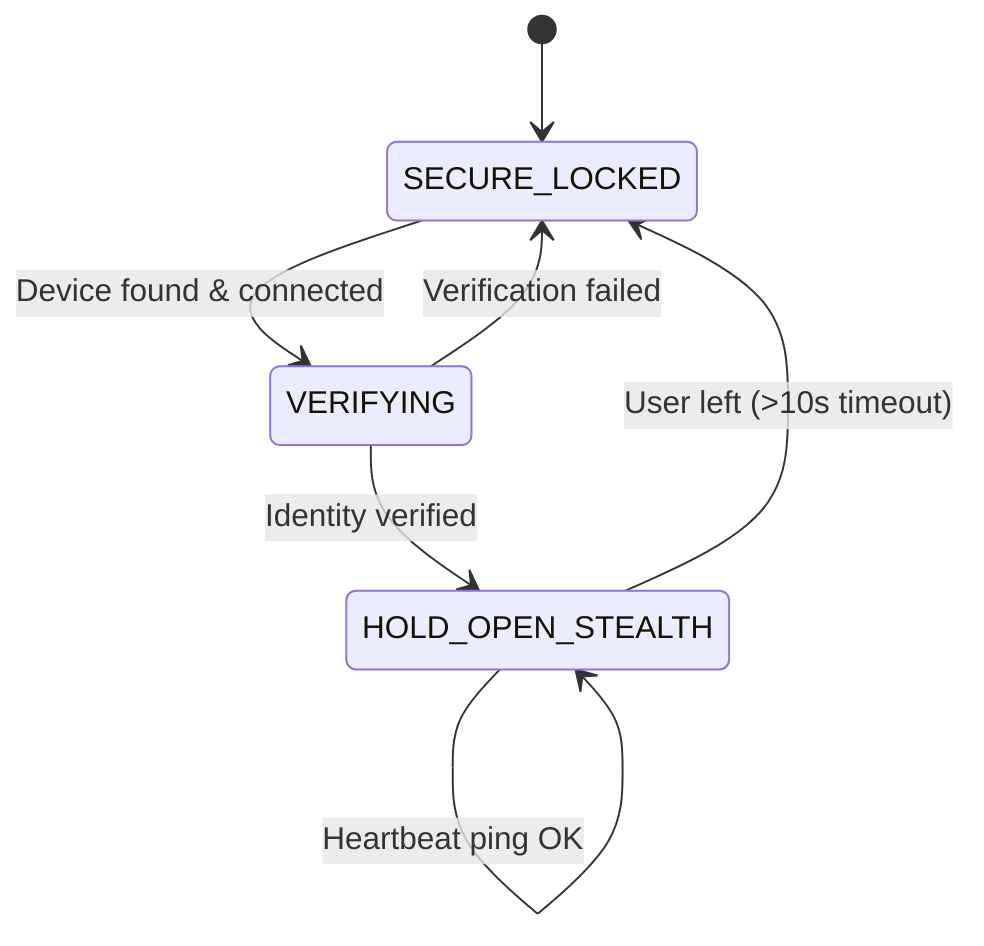

# 🔐 Ghost Lock — macOS Software Documentation

This document provides a detailed breakdown of the three core Python scripts that make up the macOS side of the Ghost Lock system.

---

## Table of Contents

1. [Overview](#overview)
2. [`main.py` — Bluetooth Auto-Lock Daemon](#mainpy--bluetooth-auto-lock-daemon)
3. [`simulation.py` — Real-Time Bluetooth Monitor](#simulationpy--real-time-bluetooth-monitor)
4. [`simulation_newapproach2.py` — Ghost Protocol v3 Simulation](#simulation_newapproach2py--ghost-protocol-v3-simulation)
5. [Shared RSSI Logic](#shared-rssi-logic)
6. [Terminal Commands](#terminal-commands)
7. [Permissions Required](#permissions-required)

---

## Overview

The Ghost Lock system uses Bluetooth Classic to detect whether a paired device (e.g., your phone) is nearby. When the phone is detected, the Mac unlocks; when it leaves, the Mac locks — automatically.

There are **three** Python scripts, each serving a different purpose:

| Script | Purpose | Actually Locks/Unlocks Mac? |
|---|---|---|
| `main.py` | **Production daemon** — locks and unlocks your Mac screen | ✅ Yes |
| `simulation.py` | **Real-time monitor** — shows live connection/RSSI state | ❌ No (display only) |
| `simulation_newapproach2.py` | **Ghost Protocol v3 simulation** — simulates the stealth state machine | ❌ No (display only) |

---

## `main.py` — Bluetooth Auto-Lock Daemon

### What It Does

This is the **real, production software**. When running, it continuously monitors your paired Bluetooth device and:

- **Locks the Mac screen** when the device disconnects or the signal drops below a threshold
- **Unlocks the Mac screen** by waking the display and auto-typing your password when the device reconnects with a strong signal

### How It Works (Step by Step)

```
┌─────────────────────────────────────────────────┐
│                   main.py                       │
│                                                 │
│  1. Parse CLI args (--device, --password, etc.) │
│  2. Find the paired Bluetooth device by MAC     │
│  3. Enter infinite monitoring loop:             │
│     ├─ Check: Is device connected?              │
│     │   ├─ NO  → lock_screen()                  │
│     │   │        Try to reconnect               │
│     │   └─ YES → Read rawRSSI()                 │
│     │       ├─ RSSI < -75 → lock_screen()       │
│     │       └─ RSSI > -65 → unlock_screen()     │
│     └─ Sleep for 1 second, repeat               │
│  4. Ctrl+C → Clean exit                         │
└─────────────────────────────────────────────────┘
```

### Key Functions

#### `lock_screen()`
Locks the Mac using **two methods** (with fallback):
1. **Primary**: Uses Apple's private `Login.framework` to call `SACLockScreenImmediate()` via PyObjC — this instantly locks the screen (same as pressing ⌘+Ctrl+Q)
2. **Fallback**: If the framework call fails, runs `pmset displaysleepnow` to put the display to sleep

#### `unlock_screen(password)`
Unlocks the Mac in two steps:
1. Calls `wake_screen()` which runs `caffeinate -u -t 1` to wake the display
2. Waits 1.5 seconds for the lock screen to appear
3. Calls `type_string(password)` to auto-type the password

#### `type_string(string)`
Simulates physical keyboard input using **Quartz CGEvent API**:
- Creates `CGEventCreateKeyboardEvent` for each character
- Uses `CGEventKeyboardSetUnicodeString` to set the character
- Posts each key-down and key-up event via `CGEventPost`
- Finishes by pressing Enter (keycode 36)

> ⚠️ This requires **Accessibility permissions** for the Terminal app

#### `get_device_by_address(address)`
Scans the Mac's paired Bluetooth devices list using `IOBluetooth.IOBluetoothDevice.pairedDevices()` and matches by MAC address (case-insensitive, handles both `-` and `:` separators).

### CLI Arguments

| Argument | Required | Default | Description |
|---|---|---|---|
| `--device` | ✅ | — | MAC address of the Bluetooth device |
| `--password` | ❌ | None | Mac login password for auto-unlock |
| `--lock-rssi` | ❌ | `-75` | RSSI threshold to trigger lock (below this = lock) |
| `--unlock-rssi` | ❌ | `-65` | RSSI threshold to trigger unlock (above this = unlock) |
| `--interval` | ❌ | `1.0` | Polling interval in seconds |

### RSSI Hysteresis

The script uses **two separate thresholds** to prevent flickering:
- Lock at **-75 dBm** (weaker signal = farther away)
- Unlock at **-65 dBm** (stronger signal = closer)
- The 10 dBm gap between them prevents rapid lock/unlock cycling when you're right at the boundary

```
Signal Strength Scale:
-30 ████████████████████ Very Close (touching)
-50 ████████████████     Close (same desk)
-65 ████████████         ← UNLOCK threshold
-70 ██████████           Moderate
-75 ████████             ← LOCK threshold
-90 ████                 Far (another room)
```

---

## `simulation.py` — Real-Time Bluetooth Monitor

### What It Does

A **live dashboard** that continuously displays the Bluetooth connection status and signal strength of your device. It does NOT lock or unlock your Mac — it only shows you what's happening in real time.

### Two Modes

#### 1. Real Device Mode (`--device`)
Connects to your actual Bluetooth device and monitors it:

```
┌───────────────────────────────────────────────────────┐
│              simulation.py (Real Mode)                │
│                                                       │
│  1. Find paired device by MAC                         │
│  2. Disconnect (clean start)                          │
│  3. Loop every 100ms:                                 │
│     ├─ Not connected? → Try openConnection()          │
│     ├─ Connected? → Try rawRSSI() then RSSI()         │
│     │   ├─ RSSI valid? → Use it                       │
│     │   └─ RSSI always invalid?                       │
│     │       → Switch to CONNECTION-BASED mode         │
│     │         (connected = present, disconnected = gone)│
│     ├─ RSSI ≥ threshold? → Mark "last seen"           │
│     └─ Not seen for 5s? → Show LOCKED                 │
│  4. Display state in real-time (single-line update)   │
└───────────────────────────────────────────────────────┘
```

**Output Examples:**
```
State: UNLOCKED 🔓 | Signal: -52 dBm | Hold: 4.3s      ← RSSI mode
State: UNLOCKED 🔓 | Mode: CONN | Connected ✓ | Hold: 3.1s   ← Connection mode
State: LOCKED 🔒  | Mode: CONN | Disconnected | Waiting...
```

#### 2. Mock Mode (`--mock`)
No real Bluetooth needed — you type RSSI values manually into the terminal to simulate different distances:

```
[INTERACTIVE] Type RSSI (e.g. -50) and Enter:
-50                                          ← You type this
[ACTION] >>> UNLOCKING 🔓
State: UNLOCKED 🔓 | Signal: -50 dBm | Hold: 4.8s
-90                                          ← You type this
[ACTION] <<< LOCKING 🔒
State: LOCKED 🔒  | Signal: -90 dBm | Waiting...
```

### Dual-Mode RSSI (Fallback Logic)

Since macOS `rawRSSI()` often returns `127` (invalid) for Android phones due to Bluetooth Sniff Mode, the script uses a **fallback chain**:

1. Try `rawRSSI()` — the standard macOS API
2. Try `RSSI()` — an alternative API that sometimes works
3. Poke the device with `remoteNameRequest_action_` to wake the radio
4. After 20 consecutive failures → **Switch to Connection-Based mode** (if connected → user is present)

### CLI Arguments

| Argument | Required | Default | Description |
|---|---|---|---|
| `--device` | ❌* | — | MAC address (use this OR `--mock`) |
| `--mock` | ❌* | — | Enable mock/interactive mode |

*One of `--device` or `--mock` is required.

---

## `simulation_newapproach2.py` — Ghost Protocol v3 Simulation

### What It Does

Simulates the **Ghost Lock v3 state machine** — the "stealth" protocol that mirrors what `NewApproch2.0.ino` does on the ESP32. It does NOT lock or unlock your Mac — it only simulates and displays the state transitions.

### The Three-State Machine

This is the heart of the Ghost Protocol. The system cycles through three states:



#### State 0: `SECURE_LOCKED` 🔒
- The "door" is locked
- The system scans by attempting `openConnection()` every 2 seconds
- If connection succeeds → attempts RSSI verification
- If RSSI unavailable (Android) → falls back to connection-based verification
- If device found → transitions to `VERIFYING`

#### State 1: `VERIFYING` ✅
- Double-checks that the device is genuinely present
- If RSSI is available: verifies signal strength is above threshold
- If RSSI is unavailable: verifies the Bluetooth connection is active
- On success → prints "UNLOCKING" and transitions to `HOLD_OPEN_STEALTH`
- On failure → transitions back to `SECURE_LOCKED`

#### State 2: `HOLD_OPEN_STEALTH` 🔓
- The "door" is held open — the unlock is active
- **Immediately disconnects** from the device (stealth — no visible Bluetooth connection)
- Periodically pings the device (connect → check → disconnect) every 2 seconds
- Each successful ping resets the "last seen" timer
- If the device hasn't been seen for **10 seconds** → transitions to `SECURE_LOCKED` (auto-lock)
- Displays a live countdown: `Lock in: 7s`

### Why "Stealth"?

The key innovation of this approach: **the system disconnects from your phone after verification**. This means:
- Your phone's Bluetooth menu doesn't show "Connected to Mac"
- No persistent connection draining your phone's battery
- The system only briefly connects every few seconds to "heartbeat ping"
- To an observer, there's no visible Bluetooth connection — hence "Ghost Lock"

### CLI Arguments

| Argument | Required | Default | Description |
|---|---|---|---|
| `--device` | ✅ | — | MAC address of the Bluetooth device |
| `--timeout` | ❌ | `10` | Seconds before auto-locking after device leaves |

---

## Shared RSSI Logic

All three scripts share the same approach to handling macOS RSSI limitations:

### The Problem
macOS's `IOBluetoothDevice.rawRSSI()` returns `127` (invalid) for most Android devices because:
1. Android enters Bluetooth **Sniff Mode** immediately after connecting to conserve power
2. In Sniff Mode, the radio only wakes at set intervals — macOS can't read signal strength between wakes
3. `remoteNameRequest_action_` is supposed to force the radio awake, but it doesn't always work for Android

### The Solution: Dual-Mode Detection

```
┌─────────────────────────────────────────┐
│         RSSI Detection Pipeline         │
│                                         │
│  1. Poke device (remoteNameRequest)     │
│  2. Try rawRSSI()                       │
│     └─ Valid? → Use RSSI mode ✓         │
│  3. Try RSSI()                          │
│     └─ Valid? → Use RSSI mode ✓         │
│  4. Retry up to 5 times                 │
│  5. All failed?                         │
│     └─ Switch to CONNECTION mode        │
│        (connected = present)            │
└─────────────────────────────────────────┘
```

- **RSSI Mode**: Used when valid readings are available (typically for Apple devices, some Bluetooth accessories)
- **Connection Mode**: Used when RSSI is unavailable (typical for Android phones). Connection state alone determines presence.

---

## Terminal Commands

### Step 1: Scan for paired devices
```bash
python3 scanner.py
```

### Step 2: Run Simulations (display only — safe to test)

**Ghost Protocol v3 Simulation:**
```bash
python3 simulation_newapproach2.py --device "9c-82-81-8b-25-fc"
```

**Real-Time Monitor:**
```bash
python3 simulation.py --device "9c-82-81-8b-25-fc"
```

**Mock Mode (no real device needed):**
```bash
python3 simulation.py --mock
```

### Step 3: Run the Real Auto-Lock Daemon

```bash
python3 main.py --device "9c-82-81-8b-25-fc" --password "Dev@071006"
```

**With custom thresholds:**
```bash
python3 main.py --device "9c-82-81-8b-25-fc" --password "Dev@071006" --lock-rssi -80 --unlock-rssi -60
```

### Stop any script
```
Ctrl + C
```

---

## Permissions Required

| Permission | Where to Grant | Required For |
|---|---|---|
| **Bluetooth** | System Settings → Privacy & Security → Bluetooth | All scripts (scanning, connecting) |
| **Accessibility** | System Settings → Privacy & Security → Accessibility | `main.py` only (keyboard simulation via Quartz) |

> Grant permissions to whichever app you run the scripts from — Terminal, iTerm, VS Code, etc.

---

## Architecture Summary

```
┌──────────────────────────────────────────────────────────────┐
│                     Ghost Lock System                        │
│                                                              │
│  ┌─────────────┐    ┌──────────────────┐    ┌────────────┐  │
│  │ scanner.py   │    │ simulation.py     │    │ main.py    │  │
│  │ (Discovery)  │    │ simulation_new*   │    │ (Daemon)   │  │
│  │              │    │ (Testing/Debug)   │    │            │  │
│  │ Lists paired │    │ Shows live state  │    │ Actually   │  │
│  │ devices +    │    │ without locking   │    │ locks and  │  │
│  │ MAC addresses│    │ the Mac           │    │ unlocks    │  │
│  └──────┬───────┘    └────────┬─────────┘    │ the Mac    │  │
│         │                     │              └──────┬─────┘  │
│         └─────────┬───────────┘                     │        │
│                   ▼                                 ▼        │
│         ┌─────────────────────────────────────────────┐      │
│         │         IOBluetooth (macOS Framework)        │      │
│         │  • pairedDevices()   • openConnection()     │      │
│         │  • rawRSSI()         • closeConnection()    │      │
│         │  • isConnected()     • remoteNameRequest()  │      │
│         └─────────────────────────────────────────────┘      │
└──────────────────────────────────────────────────────────────┘
```
